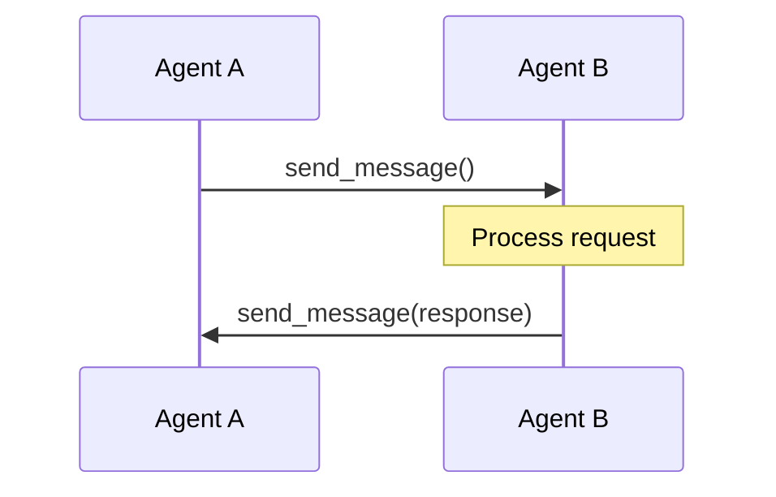
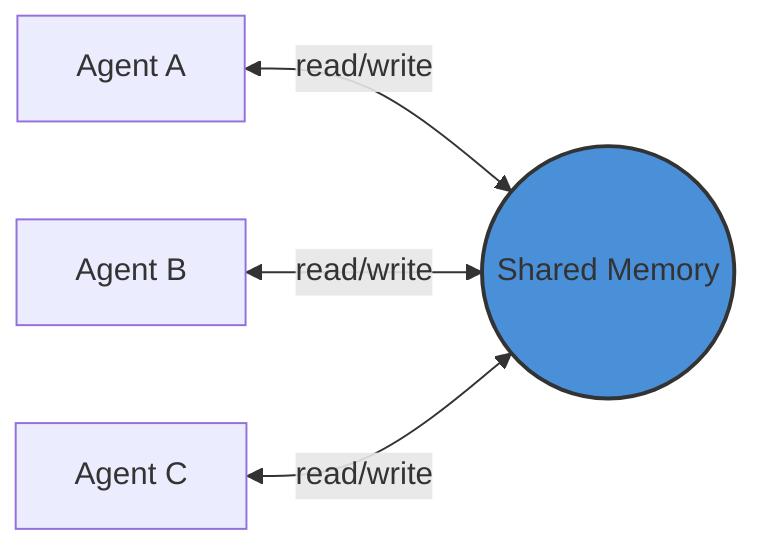
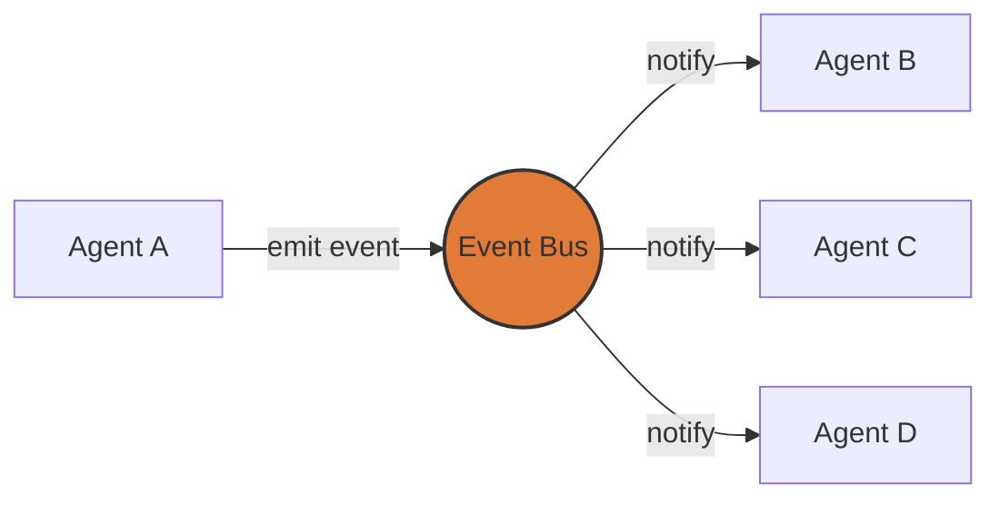
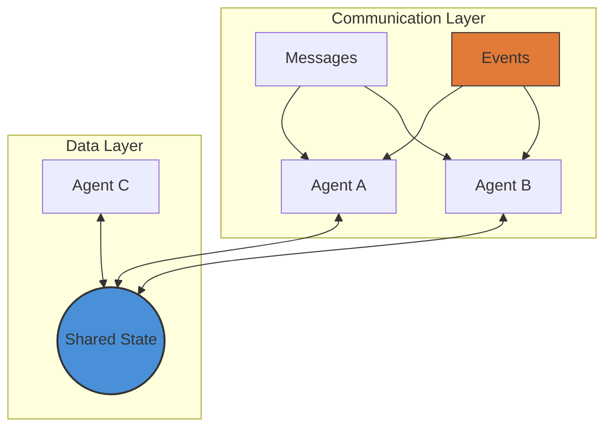

Building multi-agent systems is challenging — not because of the AI logic, but because of communication. When agents work together, they need to coordinate: one finishes and another starts, one finds data another needs, or multiple agents want the same resource.

This post covers the three main communication patterns for multi-agent systems, with a deep dive on event-driven coordination.

---

## Pattern 1: Message Passing

The simplest approach — agents send messages directly to each other.

```python
# Agent A sends a message
await agent_a.send_message(
    to="agent_b",
    content="search_memory",
    query="recent decisions",
    correlation_id="msg_123"
)

# Agent B responds
result = await agent_b.process(query)
await agent_b.send_message(
    to="agent_a",
    content="search_response",
    result=result,
    correlation_id="msg_123"
)
```

It works like email for agents.



### How it works

There are a few variants:

- **Direct addressing** — One agent sends to another
- **Broadcast** — One-to-many messaging
- **Pub/Sub** — Topic-based routing

### Tradeoffs

**Pros:**
- Loose coupling — agents don't know each other's internals
- Async by nature
- Scales well
- Clear audit trail

**Cons:**
- Message ordering gets complex
- Need correlation IDs for request-response
- Delivery guarantees are tricky
- Message overhead adds latency

### When to use

Distributed agents across different machines, async workflows, or when audit trails matter.

---

## Pattern 2: Shared State

Agents share a common memory space they can all read from and write to.

```python
from contexo import Contexo

# Shared memory for everyone
shared_ctx = Contexo(config=config)
await shared_ctx.initialize()

# Agent A writes
await shared_ctx.add_message(
    content="DECISION: Use PostgreSQL for production",
    metadata={"agent_id": "architect", "type": "decision"}
)

# Agent B reads immediately
decisions = await shared_ctx.search_memory("PostgreSQL decision")
```

Like a whiteboard that everyone can see and write on.



### Tradeoffs

**Pros:**
- Fast — no message overhead
- Simple — read/write like a database
- Easy to debug
- Natural for shared context

**Cons:**
- Tight coupling — all agents share the same schema
- Race conditions when multiple agents write at once
- Doesn't scale well — shared memory becomes a bottleneck
- Need coordination for writes

> **Note:** The `Contexo` library shown in these examples provides shared memory with provenance tracking for multi-agent systems.

### When to use

Small teams of agents (under 5), when all agents need the same context, or for synchronous workflows.

---

## Pattern 3: Event-Driven Coordination (Deep Dive)

Agents emit events when something happens; other agents react. The emitter doesn't know who's listening.

```python
class EventBus:
    def __init__(self):
        self.subscribers = {}

    def subscribe(self, event_type, handler):
        if event_type not in self.subscribers:
            self.subscribers[event_type] = []
        self.subscribers[event_type].append(handler)

    async def emit(self, event_type, data):
        for handler in self.subscribers.get(event_type, []):
            await handler(event_type, data)

# Agent emits an event
await event_bus.emit("decision_made", {
    "decision": "Use PostgreSQL",
    "by": "architect"
})

# Another agent reacts
class DatabaseAgent:
    def __init__(self, event_bus):
        event_bus.subscribe("decision_made", self.on_decision)

    async def on_decision(self, event_type, data):
        if data["decision"] == "PostgreSQL":
            await self.prepare_schema()
```

Like Slack notifications — when something happens, interested parties get notified.



### Why events work well

The decoupling is the main advantage. New agents can be added without changing existing code. Agent A emits "decision_made" and doesn't need to know that Agents B, C, and D are listening.

### Common event types

- **State changes** — `decision_made`, `task_complete`
- **Lifecycle** — `agent_started`, `agent_failed`
- **Data** — `data_available`, `model_updated`
- **Error** — `timeout`, `retry_needed`

### Advanced patterns

**Event sourcing** — Store every event as a log. Events can be replayed to reconstruct state, useful for debugging and audit trails.

```python
# Store the event
await event_log.append({
    "type": "decision_made",
    "data": {...},
    "timestamp": ...,
    "agent": "architect"
})

# Replay later
events = await event_log.get_events(conversation_id="...")
state = apply_events(events)
```

**CQRS** — Separate reads from writes. Commands mutate state via events, queries read from a separate store.

### The challenges

Events are powerful until something breaks. When Agent B reacts to an event triggered by Agent A reacting to an event from Agent C, tracing becomes difficult.

Correlation IDs help:

```python
event_id = str(uuid.uuid4())
await event_bus.emit("decision_made", {
    "data": {...},
    "correlation_id": event_id,
    "causation_id": parent_event_id
})
```

Event ordering is another issue. If events arrive out of order, sequence numbers help:

```python
class OrderedEventBus:
    def __init__(self):
        self.sequences = {}

    async def emit(self, event_type, data, agent_id):
        seq = self.sequences.get(agent_id, 0) + 1
        self.sequences[agent_id] = seq
        await self.process(event_type, data, agent_id, seq)
```

Event storms can also overwhelm the system. Debouncing and batching help, but need to be designed upfront.

### When to use

- Many agents (10+) with complex interactions
- Reactive workflows where actions trigger other actions
- Agents need to be added or removed dynamically
- Audit trails are critical

---

## Comparison

| Aspect | Message Passing | Shared State | Event-Driven |
|--------|----------------|--------------|--------------|
| Coupling | Low | High | Low |
| Latency | High | Low | Medium |
| Scalability | High | Low | High |
| Debugging | Easier | Medium | Harder |
| Best for | Distributed | Small teams | Reactive |

---

## Hybrid Approach

Real systems often combine all three:



```python
class HybridAgent:
    def __init__(self, agent_id):
        self.id = agent_id
        self.ctx = None        # Shared state
        self.mailbox = []       # Message queue

    async def initialize(self):
        # Initialize shared state connection
        self.ctx = Contexo(config=config)
        await self.ctx.initialize()

    async def send_message(self, to, content):
        # Direct message passing implementation
        await message_bus.send(to, content, from_agent=self.id)

    async def coordinate(self, task):
        # Emit event (reactive coordination)
        await event_bus.emit("task_started", {"task": task})

        # Write to shared memory (persistent state)
        await self.ctx.add_message(
            f"Started: {task}",
            metadata={"agent_id": self.id}
        )

        # Send direct message (immediate command)
        await self.send_message("teammate", task)
```

**When to mix:**
- Events for coordination ("X happened")
- Shared memory for state ("Current state is Y")
- Messages for commands ("Do Z now")

---

## Choosing a Pattern

- **Few agents (<5)** → Shared state, keep it simple
- **Need audit trail** → Message passing
- **Reactive system** → Event-driven
- **Real-time coordination** → Shared state

Most production systems mix patterns based on the specific use case.

---

## Tools & Libraries

- **Contexo** — Shared memory with provenance tracking
- **LangGraph** — Agent orchestration with state machines
- **CrewAI** — Multi-agent framework
- **Redis Pub/Sub** — Simple event streaming
- **RabbitMQ** — Reliable message queues
- **Kafka** — Event streaming at scale

---

## Common Pitfalls

1. **Over-engineering** — Don't use events for two agents talking
2. **No failure handling** — What happens when an agent crashes?
3. **Race conditions** — Shared state without coordination causes bugs
4. **Debugging complexity** — Distributed systems are hard to debug

---

## Conclusion

No single pattern fits every use case. Start simple with shared state for small teams, add message passing as you scale, and use events for reactive workflows.

Communication is the hardest part of multi-agent systems. Design for observability from the start, test early, and add complexity only when needed.

---

**Try the examples with [Contexo](https://github.com/rbalachandar/contexo)**
